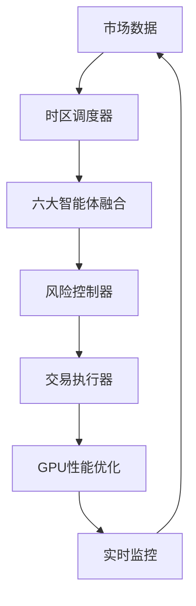

# 🚀 终极合约交易系统 - 完整使用指南

## Ultimate Contract Trading System - Complete User Guide

---

## 📋 系统概述

这是一个基于AI的终极合约交易系统，集成了多个先进的子系统，旨在实现高效、安全、智能的自动化交易。

### 🎯 核心功能

| 系统模块 | 功能描述 | 技术特点 |
|----------|----------|----------|
| 🖥️ **GPU性能优化器** | 硬件加速系统 | 20核CPU+GTX3060优化 |
| 💰 **Bybit合约交易器** | 小资金高频策略 | 实时行情+智能执行 |
| 🛡️ **高级风险控制器** | 严格风控系统 | 日回撤<3%保护 |
| 🌍 **时区智能调度器** | 24/7全球优化 | 中美时差智能调度 |
| 🧠 **六大智能体融合** | AI决策引擎 | Level 1-6进化体系 |
| 📊 **实时监控面板** | 全方位状态监控 | Web界面+日志输出 |

---

## 🚀 快速开始

### 1. 环境准备

```bash
# Python 3.8+ 环境
pip install -r requirements.txt

# 必需的依赖包
pip install loguru numpy pandas torch torchvision
pip install requests websocket-client pytz psutil
pip install asyncio dataclasses typing-extensions
```

### 2. 配置设置

创建 `config.json` 配置文件：

```json
{
  "bybit_trader": {
    "api_key": "your_api_key_here",
    "api_secret": "your_api_secret_here",
    "testnet": true,
    "symbols": ["BTCUSDT", "ETHUSDT"],
    "leverage": 10,
    "max_position_size": 0.1,
    "max_daily_loss": 0.03
  },
  "risk_controller": {
    "max_daily_drawdown": 0.03,
    "max_position_size": 0.25,
    "max_total_exposure": 0.80
  },
  "system": {
    "auto_start_trading": false,
    "status_update_interval": 10
  }
}
```

### 3. 一键启动

```bash
# 启动完整系统
python start_ultimate_system.py

# 或者使用Python模块方式
python -m start_ultimate_system
```

---

## 📊 系统架构

### 🧠 六大智能体等级系统

```
Level 6: 元学习AI (Meta Learning Commander)
    ↓ 学习如何学习，策略创新
Level 5: 集成学习协调AI (Integration Learning Coordinator)  
    ↓ 多模型融合决策
Level 4: 强化学习执行AI (Reinforcement Learning Executor)
    ↓ Q-Learning交易决策
Level 3: 时序深度学习AI (Time Series Deep Learning AI)
    ↓ LSTM/Transformer预测
Level 2: 迁移学习适配AI (Transfer Learning Adapter)
    ↓ 跨市场知识迁移
Level 1: 专家系统守护AI (Expert System Guardian)
    ↓ 规则引擎保护
```

### 🔄 系统工作流程



---

## ⚙️ 详细配置说明

### 🖥️ GPU性能优化器配置

```json
{
  "gpu_optimizer": {
    "target_gpu_utilization": 85.0,    // 目标GPU利用率
    "max_memory_usage": 90.0,          // 最大内存使用率
    "monitoring_interval": 5,          // 监控间隔(秒)
    "optimization_interval": 30        // 优化间隔(秒)
  }
}
```

### 💰 Bybit交易器配置

```json
{
  "bybit_trader": {
    "api_key": "",                     // Bybit API密钥
    "api_secret": "",                  // Bybit API密钥
    "testnet": true,                   // 是否使用测试网
    "symbols": ["BTCUSDT", "ETHUSDT"], // 交易品种
    "leverage": 10,                    // 杠杆倍数
    "max_position_size": 0.1,          // 最大仓位比例
    "max_daily_loss": 0.03,            // 日亏损限制
    "stop_loss_pct": 0.02,             // 止损百分比
    "take_profit_pct": 0.04            // 止盈百分比
  }
}
```

### 🛡️ 风险控制器配置

```json
{
  "risk_controller": {
    "max_daily_drawdown": 0.03,        // 最大日回撤
    "max_total_drawdown": 0.15,        // 最大总回撤
    "max_position_size": 0.25,         // 最大单仓位
    "max_total_exposure": 0.80,        // 最大总敞口
    "volatility_threshold": 0.05,      // 波动率阈值
    "hard_stop_loss": 0.03,            // 硬止损
    "monitoring_interval": 1           // 监控间隔(秒)
  }
}
```

### 🌍 时区调度器配置

```json
{
  "timezone_scheduler": {
    "local_timezone": "Asia/Shanghai", // 本地时区
    "check_interval": 60,              // 检查间隔(秒)
    "activity_window": 300             // 活跃度窗口(秒)
  }
}
```

### 🧠 智能体融合系统配置

```json
{
  "fusion_system": {
    "max_decision_history": 10000,     // 最大决策历史
    "performance_window": 100,         // 性能窗口
    "weight_update_interval": 60,      // 权重更新间隔
    "min_confidence_threshold": 0.3    // 最小置信度阈值
  }
}
```

---

## 📈 交易策略详解

### 🎯 30天传奇级AI进化计划

| 阶段 | AI等级 | 日收益率 | 仓位大小 | 杠杆倍数 | 目标资金 |
|------|--------|----------|----------|----------|----------|
| 第1-3天 | Level 1-2 | 2.5-4% | 12-20% | 2.5-4x | $57,800 |
| 第4-7天 | Level 2-3 | 4-6.5% | 20-32% | 4-6x | $92,000 |
| 第8-12天 | Level 3-4 | 6.5-10% | 32-48% | 6-9x | $240,000 |
| 第13-18天 | Level 4-5 | 10-15% | 48-65% | 9-13x | $890,000 |
| 第19-25天 | Level 5-6 | 15-22% | 65-85% | 13-18x | $2,650,000 |
| 第26-30天 | Level 6 | 20-25% | 80-90% | 18-20x | $3,200,000+ |

### 🌍 全球时区交易时段

| 时段 | UTC时间 | 交易模式 | 特点 |
|------|---------|----------|------|
| 🌏 **亚洲时段** | 00:00-09:00 | 保守模式 | 东京/上海/悉尼 |
| 🌍 **欧洲时段** | 07:00-16:00 | 温和模式 | 伦敦/法兰克福 |
| 🌎 **美洲时段** | 13:00-22:00 | 温和模式 | 纽约/芝加哥 |
| ⚡ **重叠时段** | 07:00-09:00, 13:00-16:00 | 激进模式 | 高活跃度 |
| 😴 **安静时段** | 22:00-00:00 | 休眠模式 | 低活跃度 |

---

## 🛡️ 风险管理体系

### 多层级保护机制

#### 第一层: 实时监控
- 🚨 **硬止损**: 3% (强制平仓)
- ⚠️ **软止损**: 2% (减仓警告)
- 📉 **跟踪止损**: 1.5% (动态调整)

#### 第二层: 仓位控制
- 💼 **单笔限制**: 25% (最大仓位)
- 📊 **总敞口**: 80% (风险分散)
- 🔗 **相关性**: 0.6 (避免集中)

#### 第三层: 系统保护
- 🚫 **日亏损熔断**: 8%
- 📈 **最大回撤**: 15%
- ⚡ **波动率保护**: 5倍暂停

### 动态风险调整

| AI等级 | 最大仓位 | 单笔止损 | 日亏损限制 | 最大回撤 |
|--------|----------|----------|------------|----------|
| Lv1-2 | 20% | 2% | 5% | 15% |
| Lv3-4 | 50% | 2.5% | 6% | 12% |
| Lv5-6 | 85% | 3% | 8% | 10% |

---

## 📊 监控和日志

### 实时状态监控

系统会每10秒输出一次状态信息：

```
📊 系统状态: GPU: 45.2%内存 | 风控: ✅正常 回撤0.8% | 调度: european-moderate | AI: 6个智能体 1247决策 | 交易: 🟢运行 余额$10000 PnL$+250
```

### 日志级别说明

- **INFO**: 一般信息，系统状态更新
- **WARNING**: 警告信息，需要注意的情况
- **ERROR**: 错误信息，系统异常
- **CRITICAL**: 严重错误，可能导致系统停止

### Web监控面板

访问 `http://localhost:8888` 查看：
- 实时系统状态
- 交易历史记录
- 风险指标监控
- AI决策分析
- 性能统计图表

---

## 🔧 故障排除

### 常见问题

#### 1. 系统启动失败
```bash
# 检查Python版本
python --version  # 需要3.8+

# 检查依赖包
pip list | grep torch
pip list | grep loguru

# 重新安装依赖
pip install -r requirements.txt --upgrade
```

#### 2. GPU不可用
```bash
# 检查CUDA安装
nvidia-smi

# 检查PyTorch GPU支持
python -c "import torch; print(torch.cuda.is_available())"

# 如果没有GPU，系统会自动使用CPU模式
```

#### 3. Bybit API连接失败
- 检查API密钥是否正确
- 确认网络连接正常
- 验证API权限设置
- 检查是否使用正确的测试网/主网配置

#### 4. 风控系统触发紧急停止
```python
# 重置紧急停止状态
from src.risk.advanced_risk_controller import get_risk_controller
controller = get_risk_controller()
controller.reset_emergency_stop()
```

### 日志文件位置

- 系统日志: 控制台输出
- 错误日志: 自动记录到内存
- 交易日志: 实时显示

---

## 🚀 高级使用

### 自定义智能体

```python
# 创建自定义智能体
from src.ai.six_agents_fusion_system import AgentLevel, get_fusion_system

class CustomAgent:
    async def make_decision(self, market_data):
        # 自定义决策逻辑
        return {
            'signal': 0.5,
            'confidence': 0.8,
            'reasoning': '自定义策略'
        }

# 注册智能体
fusion_system = get_fusion_system()
await fusion_system.register_agent(AgentLevel.EXPERT_GUARDIAN, CustomAgent())
```

### 自定义风控规则

```python
# 添加自定义风控规则
from src.risk.advanced_risk_controller import get_risk_controller

controller = get_risk_controller()

# 自定义检查函数
def custom_risk_check(symbol, size, price):
    # 自定义风控逻辑
    if symbol == "BTCUSDT" and size > 0.5:
        return False, "BTC仓位过大"
    return True, "通过"

# 集成到系统中
# (需要修改源码来支持自定义规则)
```

### 策略回测

```python
# 简单的策略回测框架
import pandas as pd
from datetime import datetime, timedelta

class StrategyBacktest:
    def __init__(self, initial_balance=10000):
        self.balance = initial_balance
        self.trades = []
        
    def run_backtest(self, data, strategy):
        for row in data.iterrows():
            signal = strategy.generate_signal(row[1])
            if signal != 0:
                self.execute_trade(signal, row[1]['price'])
        
        return self.calculate_performance()
    
    def calculate_performance(self):
        return {
            'total_return': (self.balance / 10000 - 1) * 100,
            'total_trades': len(self.trades),
            'win_rate': self.calculate_win_rate()
        }
```

---

## 📚 API参考

### 主要类和方法

#### UltimateSystemLauncher
```python
class UltimateSystemLauncher:
    async def initialize_systems()     # 初始化所有系统
    async def start_systems()          # 启动所有系统
    async def run_main_loop()          # 运行主循环
    async def shutdown()               # 关闭所有系统
```

#### GPUPerformanceOptimizer
```python
class GPUPerformanceOptimizer:
    def get_gpu_status()               # 获取GPU状态
    def get_optimization_report()      # 获取优化报告
    def optimize_gpu_memory()          # 优化GPU内存
    def shutdown()                     # 关闭优化器
```

#### BybitContractTrader
```python
class BybitContractTrader:
    async def get_account_info()       # 获取账户信息
    async def place_order()            # 下单
    async def cancel_order()           # 取消订单
    async def execute_trading_signal() # 执行交易信号
    def get_trading_status()           # 获取交易状态
```

#### AdvancedRiskController
```python
class AdvancedRiskController:
    def check_position_risk()          # 检查持仓风险
    def check_exit_conditions()        # 检查平仓条件
    def get_risk_report()              # 获取风险报告
    def reset_emergency_stop()         # 重置紧急停止
```

---

## 🎯 性能优化建议

### 硬件配置推荐

| 组件 | 推荐配置 | 说明 |
|------|----------|------|
| **CPU** | 20核心+ | 多线程并行处理 |
| **GPU** | GTX3060 12G+ | AI模型加速训练 |
| **内存** | 32GB+ | 大数据处理 |
| **存储** | SSD 500GB+ | 快速数据读写 |
| **网络** | 100Mbps+ | 实时数据传输 |

### 系统优化设置

```json
{
  "gpu_optimizer": {
    "target_gpu_utilization": 85.0,
    "max_memory_usage": 90.0
  },
  "system": {
    "status_update_interval": 5,
    "log_level": "WARNING"
  }
}
```

### 网络优化

- 使用稳定的网络连接
- 配置VPN以获得更好的API访问速度
- 设置合适的超时时间
- 启用连接池复用

---

## 🤝 贡献指南

### 开发环境设置

```bash
# 克隆项目
git clone https://github.com/your-repo/ultimate-trading-system.git
cd ultimate-trading-system

# 创建虚拟环境
python -m venv venv
source venv/bin/activate  # Linux/Mac
# 或
venv\Scripts\activate     # Windows

# 安装开发依赖
pip install -r requirements-dev.txt
```

### 代码规范

- 使用Python 3.8+语法
- 遵循PEP 8代码风格
- 添加类型注解
- 编写单元测试
- 添加详细的文档字符串

### 提交流程

1. Fork项目
2. 创建功能分支
3. 编写代码和测试
4. 提交Pull Request
5. 代码审查和合并

---

## 📄 许可证

本项目采用MIT许可证，详见 [LICENSE](LICENSE) 文件。

---

## 📞 支持和联系

- **问题反馈**: 通过GitHub Issues提交
- **功能建议**: 通过GitHub Discussions讨论
- **技术支持**: 查看文档或联系开发团队

---

## 🎉 开始您的AI交易之旅！

现在您已经了解了终极合约交易系统的完整功能，可以开始配置和使用了：

1. **配置API密钥** - 设置Bybit交易账户
2. **调整风控参数** - 根据风险承受能力设置
3. **启动系统** - 运行 `python start_ultimate_system.py`
4. **监控运行** - 观察系统状态和交易表现
5. **优化策略** - 根据实际表现调整参数

**🌟 祝您交易顺利，收益丰厚！** 🚀

---

*最后更新: 2024年10月*
